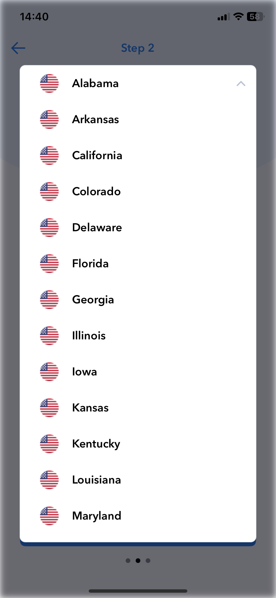

# SwiftUI Customisable Item Picker




SwiftUI Customisable Item Picker is a versatile and easy-to-use picker component built with SwiftUI. It allows you to create a customisable item picker with the ability to expand and hover over the entire screen.

## Features

- **UI Customization:** Customize the appearance of the item picker to match your app's design and theme.

- **Custom Item Content:** Define custom content for each item in the picker, giving you complete control over the display.

- **Section Support:** Organize your items into sections for better categorization and presentation.

## Usage

```swift
import SwiftUI
import CustomisableItemPicker

struct ContentView: View {
@State private var selectedItem: String?

var body: some View {
ExandableItemPicker(
data: model.regions,
selectedItem: $model.region
) {
RegionView(
flag: model.flagImage,
name: $0.name,
code: ""
)
.frame(maxWidth: .infinity)
.frame(height: 54)
.cornersRadius(8)
.padding([.leading, .trailing], 14)
}
.frame(height: 54)
}
}
